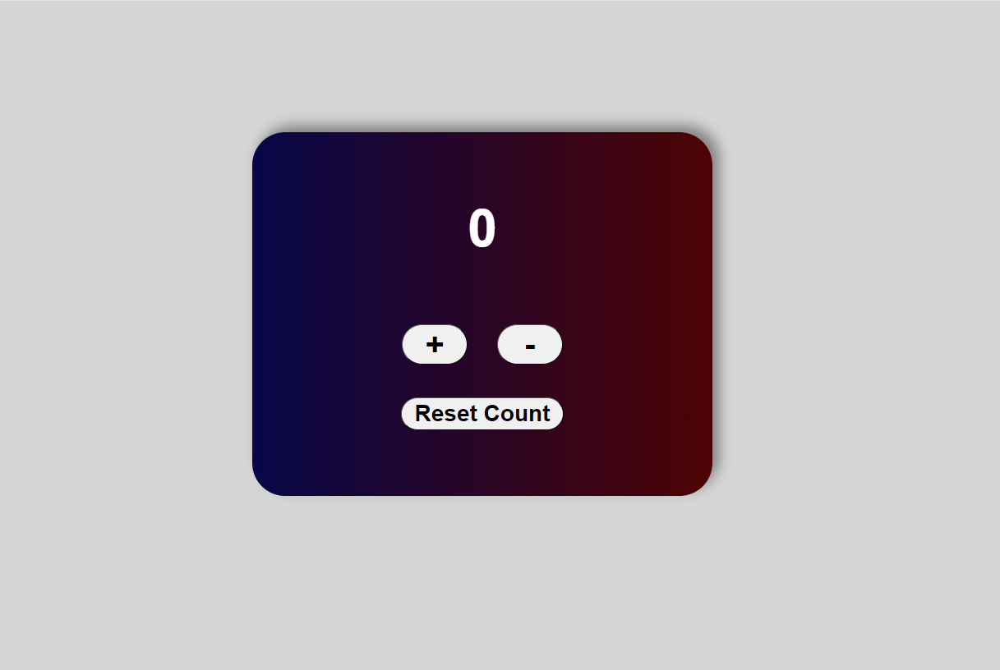

# Counter
# Descrizione
Il progetto Counter è un'applicazione web che permette di incrementare, decrementare e resettare un contatore tramite un'interfaccia utente semplice e intuitiva.

# Link

Link dove poter visionare e usare il progetto: https://peaceful-moxie-e8c78f.netlify.app/

# Built With
HTML
CSS
JavaScript

# Getting Started
Apri il counter al link: "https://peaceful-moxie-e8c78f.netlify.app/", una volta aperta la pagina sarà possibile incrementare il counter di 1 premendo sul "+" e diminuirlo premendo "-", per resettare il counter premere "reset count"

# Prerequisites
Non sono presenti requisiti necessari

# Usage
Usare il counter per tenere il conto.

Esempi di utilizzo:

1. Incremento del Contatore
Cliccando ripetutamente sul pulsante +, il numero visualizzato aumenterà di uno ad ogni clic.

2. Decremento del Contatore
Cliccando ripetutamente sul pulsante -, il numero visualizzato diminuirà di uno ad ogni clic.

3. Reset del Contatore
Cliccando sul pulsante Reset Count, il contatore verrà riportato a zero indipendentemente dal valore corrente.

# Contributing
Qualsiasi contributo è grandemente apprezzato.

Se hai un suggerimento per migliorare il progetto, per favore fai un fork del repository e crea una pull request. 

Non dimenticare di dare una stella al progetto! Grazie ancora!

# License
Distribuito sotto la licenza MIT. Vedi LICENSE.txt per maggiori informazioni.

# Contact
Luca Sannia - X: @lucasanniaxx - information@lucasannia.com

Link del progetto: https://github.com/SLuca-24/Counter
